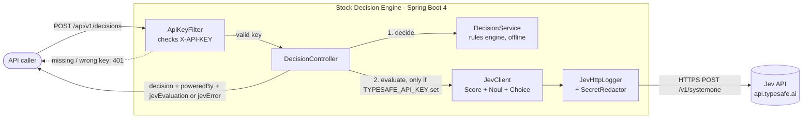
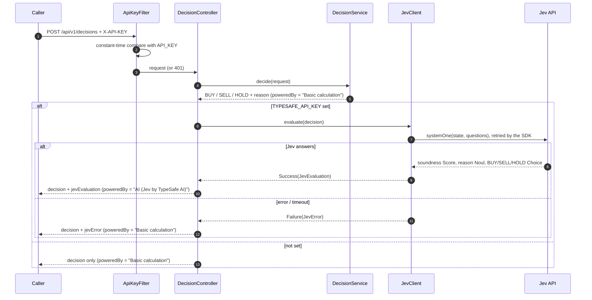

# Architecture

Stock Decision Engine turns a stock position (average purchase price and current price) into a
**BUY / SELL / HOLD** decision. A local rules engine makes every decision. When `TYPESAFE_API_KEY` is set,
**Jev**, TypeSafe AI's judgment model, also scores that decision and gives its own pick.

## How it works

### Request flow

Key properties:

- **The rules engine is always the source of the decision.** Jev only *evaluates* it. If Jev is
  off, slow or failing, the caller still gets a decision, with `jevError` saying what went wrong.
- **One Jev call per request.** All three questions go in a single `systemOne` request.
- **Jev sees only the request data:** prices, change %, thresholds, and the rules decision and reason.
  No market data, user identity or keys are sent.

## Components

| Package | Class | Responsibility |
|---|---|---|
| `api` | `DecisionController` | REST endpoint. Runs the rules, then Jev if it's configured, and merges the results. |
| | `GlobalExceptionHandler` | Turns validation and JSON errors into RFC 7807 `ProblemDetail` responses. |
| `service` | `DecisionService` | Pure rules engine: computes the change % and applies take-profit, stop-loss and average-down. No I/O. |
| `jev` | `JevClient` | Builds the Jev state and questions, calls the SDK, maps answers to `JevEvaluation` and exceptions to `JevError`, and logs the outcome. |
| | `JevConfig` | Creates `TypeSafeClient`, `JevClient` and the redactor **only** when `typesafe.api-key` is non-empty. |
| | `JevHttpLogger` | HTTP interceptor: logs URL, status, latency and request id for every attempt (bodies at DEBUG), redacted. |
| | `JevStartupLogger` | Logs at startup whether Jev is enabled. |
| | `JevResult` | Sealed `Success` / `Failure` result, so the controller has to handle both. |
| `security` | `ApiKeyFilter` | Protects `/api/**` with `X-API-KEY`. The app refuses to start without `API_KEY`. |
| | `SecretRedactor` | Masks known keys and `Bearer` tokens in anything logged or returned. |
| `config` | `DecisionProperties` | Validated thresholds (`decision.*`). |
| | `TypeSafeProperties` | Jev settings (`typesafe.*`). `toString()` masks the key. |
| | `AppConfig` | `Clock` (for testable timestamps) and OpenAPI / Swagger metadata. |
| `model` | `DecisionRequest`, `DecisionResponse`, `Decision`, `JevEvaluation`, `JevError` | API contract (Java records). |

## What Jev is asked

Jev's API takes a **state** (what to judge) plus named, typed **questions**, and returns typed answers.
`JevClient` asks:

| Name | Type | Question | Answer used |
|---|---|---|---|
| `soundness` | `Score`, 4 levels: Unsound, Questionable, Reasonable, Sound | How sound is the recommended action? | Continuous value from 0 to 3, nearest label, confidence |
| `reason_consistent` | `Noul` (yes/no) | Does the stated reason match the numbers and thresholds? | Truth value from 0 to 1 |
| `jev_decision` | `Choice` (BUY / SELL / HOLD) | Which action would you take? | Label, per-option probabilities, confidence |

`agreesWithRules` is computed locally by comparing Jev's choice with the rules decision.

## Technology and packages

| Package | Version | What it is | Used here for |
|---|---|---|---|
| **Java** | 21 | Language and runtime | Records for DTOs, a sealed interface plus pattern-matching `switch` for `JevResult`. |
| **Spring Boot** (`spring-boot-starter-webmvc`) | 4.0.8 | Opinionated Spring setup with auto-configuration and an embedded server | App bootstrap, config binding (`@ConfigurationProperties`), conditional beans (`@ConditionalOnExpression` for Jev). |
| **Spring Framework** (`spring-webmvc`, `spring-web`) | 7.0.9 | Core web framework | `@RestController`, the servlet filter for the API key, and `RestClient` plus `ClientHttpRequestInterceptor` for the Jev HTTP calls. |
| **Apache Tomcat** (embedded) | 11.0 | Servlet container | Serves HTTP on port 8080. |
| **TypeSafe Java SDK** (`org.springaicommunity:typesafe-java-sdk`) | 0.4.0 | Client for TypeSafe AI's Jev API (see the [Spring blog post](https://spring.io/blog/2026/09/21/spring-ai-typesafe-structured-judgment)) | `TypeSafeClient.systemOne(...)` and the `Score`, `Noul` and `Choice` question builders, typed answers (`ScoreAnswer`, `ChoiceAnswer`, `NoulAnswer`), built-in retries, and typed exceptions (`TypeSafeAuthenticationException`, `TypeSafeRateLimitException`, ...) mapped to `JevError` codes. It's the reason for Boot 4: every SDK release needs Spring 7 and Jackson 3. |
| **Jackson 3** (`tools.jackson`) | 3.1 | JSON library | Serializes API responses (Boot 4 default) and the Jev request and response bodies inside the SDK. |
| **Jackson 2** (`com.fasterxml.jackson`) | 2.21 | JSON library (previous major version) | Pulled in by springdoc / swagger-core to generate the OpenAPI document. Its annotations package is shared with Jackson 3. |
| **Jakarta Bean Validation** (Hibernate Validator) | 9.0 | Declarative validation | `@NotBlank`, `@DecimalMin`, `@Digits` on `DecisionRequest`, and `@Validated` thresholds that fail startup if misconfigured. |
| **springdoc-openapi** | 3.0.3 | OpenAPI 3 generation plus Swagger UI for Spring Boot 4 | `/v3/api-docs` and `/swagger-ui.html` with the `X-API-KEY` security scheme. |
| **Spring Boot Actuator** | 4.0.8 | Operational endpoints | `/actuator/health` and `/info` only. `env` and `configprops` are deliberately **not** exposed. |
| **SLF4J + Logback** | 2.0 / 1.5 | Logging API and implementation | All Jev logs. Level set with `JEV_LOG_LEVEL`. |
| **JUnit 5, Mockito, AssertJ, MockMvc, MockRestServiceServer** | via `spring-boot-starter-webmvc-test` | Testing | Unit tests with a mocked `TypeSafeClient`, MVC tests of the full HTTP contract, interceptor tests against a mock server, and log-capture tests that check no key is logged. |
| **Maven** / **Docker** (Temurin 21 JRE, Alpine) | | Build and packaging | Multi-stage image that runs as a non-root `app` user. Keys are supplied only at `docker run`. |

## Secrets handling

| Secret | Source | Protections |
|---|---|---|
| `API_KEY` (callers → this service) | Environment variable only | Never in code, config or the image. Compared in constant time (`MessageDigest.isEqual`). The 401 response never echoes the key it was sent. The app won't start without it. |
| `TYPESAFE_API_KEY` (this service → Jev) | Environment variable only | Never in code, config or the image. Sent only by the SDK, in a request header. **Headers are never logged.** `TypeSafeProperties.toString()` prints `****`. |

Defence in depth: `SecretRedactor` knows both keys and masks them, along with any `Bearer ...` token,
in every Jev URL, request and response body, error message, and DEBUG stack trace before it's logged or
returned in `jevError`. Actuator `env` and `configprops`, which could expose config values, aren't
exposed. `.env` is excluded by `.gitignore` and `.dockerignore`.

These are covered by `SecretRedactorTest`, `JevHttpLoggerTest.neverLogsTheApiKey` and
`JevClientTest.redactsSecretsFromErrorMessage`. A full DEBUG-level run with canary keys found no
occurrences in logs, API responses, Swagger or actuator output.
